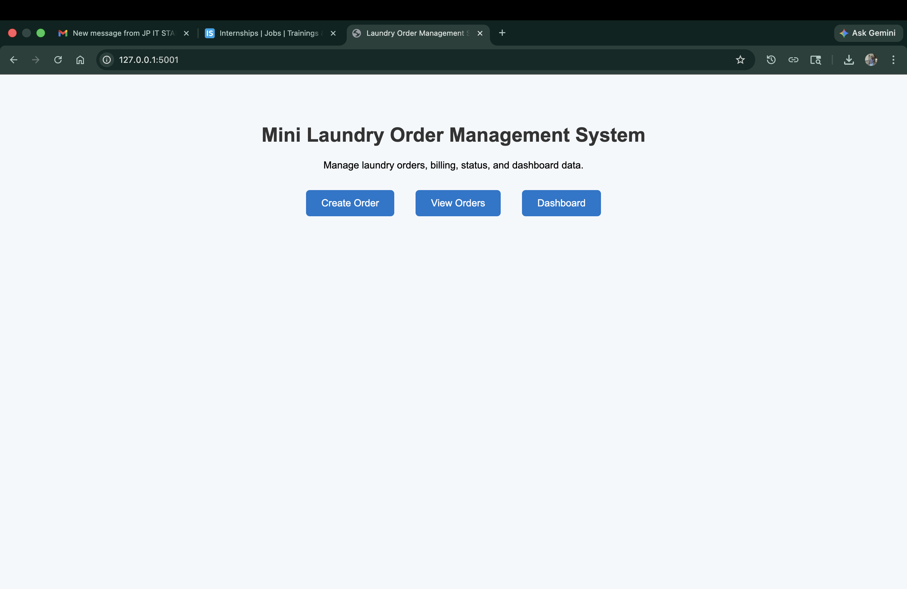
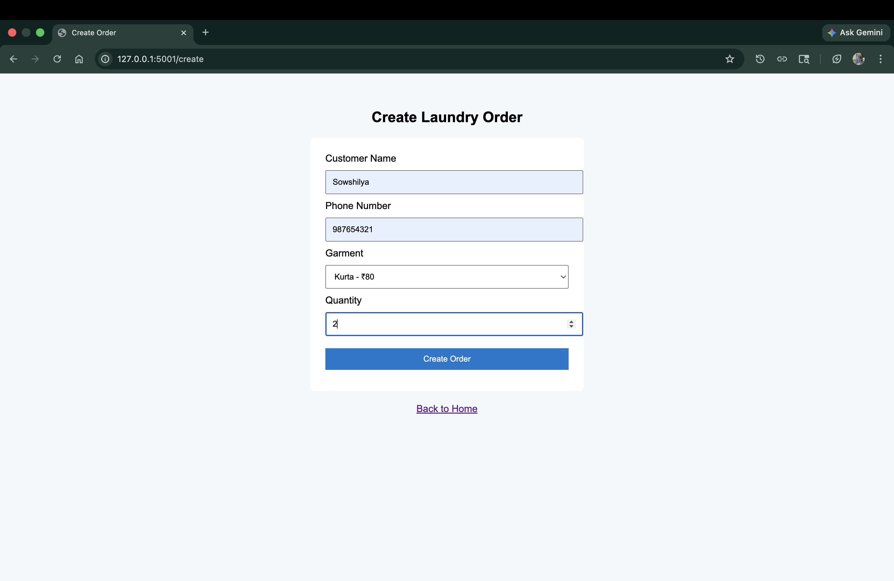
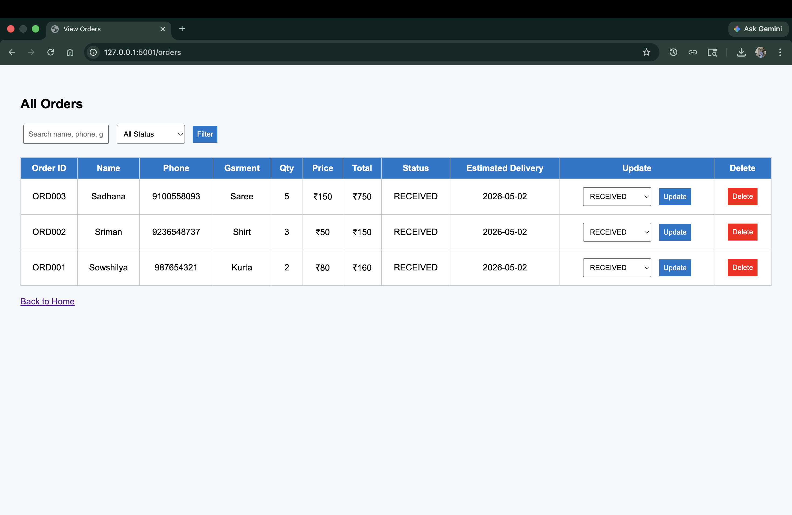
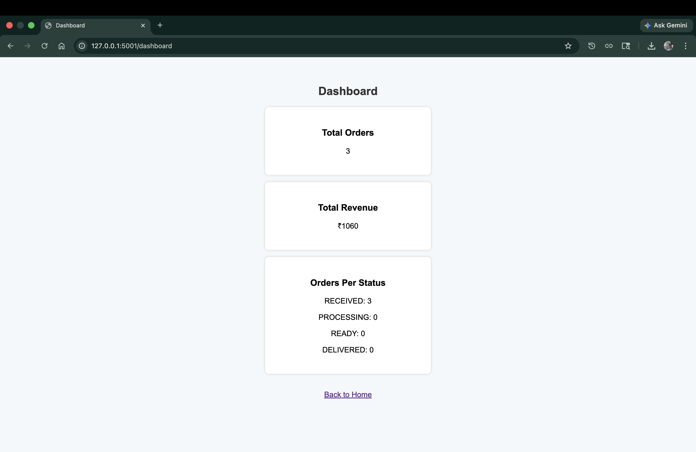

🧺 Mini Laundry Order Management System
A simple web-based application built using Flask to manage laundry orders, billing, and tracking.
Features

* Create laundry orders
* Generate unique Order IDs
* Calculate total billing
* Update order status (RECEIVED → PROCESSING → READY → DELIVERED)
* View and filter orders
* Dashboard with:

  * Total orders
  * Total revenue
  * Orders per status
* Delete orders
* Estimated delivery date
* SQLite database for storage

🛠 Tech Stack

* Python (Flask)
* HTML (Templates)
* SQLite (Database)

⚙️ Setup Instructions

Install dependencies

pip install -r requirements.txt

Run the project

python3 app.py

Open in browser

http://127.0.0.1:5001

📸 Screenshots

🏠 Home Page

➕ Create Order

📋 Orders Page

📊 Dashboard

🤖 AI Usage Report

I used ChatGPT to:

* Understand the requirements
* Generate backend Flask code
* Build HTML templates
* Implement database functionality
* Debug and fix errors

Improvements made manually:

* Fixed logic issues
* Added delete functionality
* Improved UI flow
* Organized project structure

⚖️ Tradeoffs

* Used SQLite instead of full-scale database
* Simple UI instead of advanced frontend

🔮 Future Improvements

* Add authentication
* Deploy application online
* Improve UI with React
* Add advanced search
* Add notifications

📌 Note

This application runs locally.
For demo, please refer to the screenshots above.

🔗 GitHub Repository

https://github.com/sowshilya-13/mini-laundry-order-system
